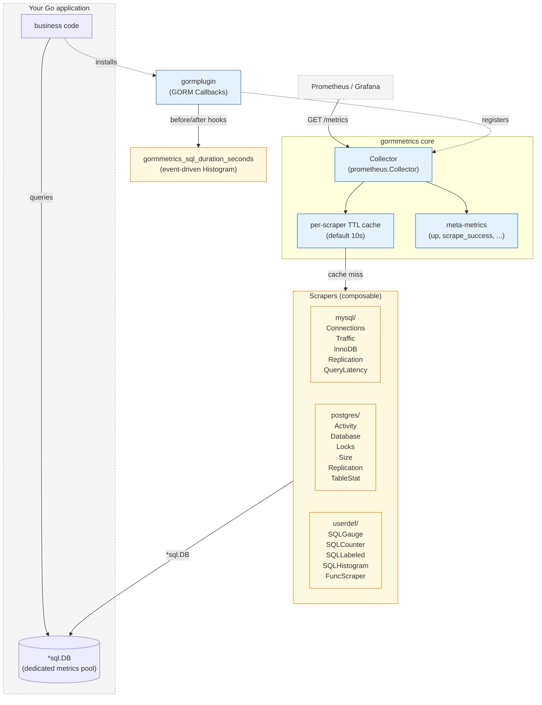
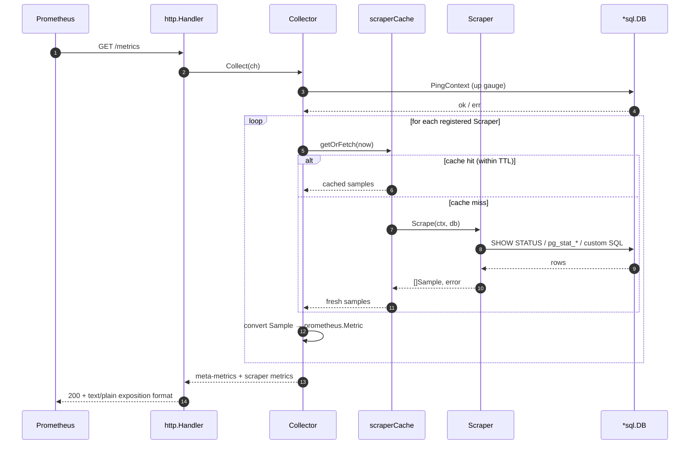
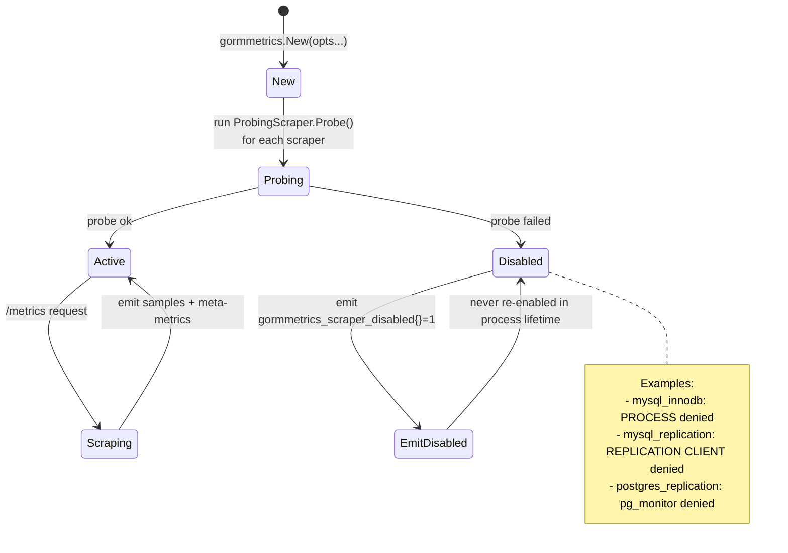
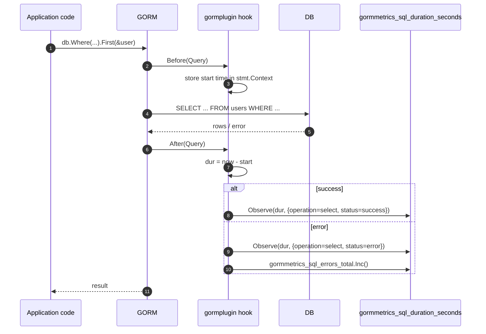

# gormmetrics

> Languages: **English** | [中文](README.zh-CN.md)

An embeddable Prometheus exporter for SQL databases in Go applications.
Exposes both database internals (via `SHOW STATUS`, `pg_stat_*`, etc.) and
per-statement instrumentation, plus ergonomic helpers for application-defined
custom metrics — all served from a single `/metrics` endpoint.

```go
c, _ := gormmetrics.New(
    gormmetrics.WithDB(sqlDB),
    gormmetrics.WithScrapers(mysql.StandardPack()...),
    gormmetrics.WithLabels(map[string]string{"cluster": "prod"}),
)
http.Handle("/metrics", c.Handler())
```

## Features

| Feature | Description |
|---------|-------------|
| **Lazy scrape model** | Metrics are pulled on `/metrics` request, not in a background goroutine. A short TTL cache (default 10s) absorbs repeat pulls so multiple Prometheus instances don't fan out into duplicate DB queries. |
| **Stateless counters** | Counters are transmitted as absolute server-reported values (`CounterValue`). Prometheus's `rate()` handles resets — no per-process delta tracking, consistent across replicas. |
| **Composable scrapers** | Every backend's scraper is a small, single-responsibility unit. Presets like `mysql.StandardPack()` are just `[]Scraper` — cherry-pick or mix-and-match per environment. |
| **GORM-optional core** | Core API takes `*sql.DB`. The separate [gormplugin](https://github.com/phpgao/gormplugin) repo provides GORM integration when you want it. |
| **Histogram support** | `userdef.SQLHistogram` for pre-bucketed query results; `gormplugin.WithSQLLatency()` for real-time per-statement timings partitioned by operation/dialector/status. |
| **Permission backoff** | Scrapers that need elevated grants (`PROCESS`, `pg_read_all_stats`, …) probe at startup via the `ProbingScraper` interface. Failure permanently disables that scraper and surfaces as `gormmetrics_scraper_disabled{}`. Never spams ERROR logs. |
| **Three-tier presets per backend** | `MinimalPack` / `StandardPack` / `FullPack` — strict supersets. Start small, grant more privileges later, get more metrics without touching application code. |
| **Always-on meta-metrics** | `gormmetrics_up`, `gormmetrics_scrape_success`, `gormmetrics_scrape_duration_seconds`, `gormmetrics_scrape_errors`, `gormmetrics_scraper_disabled` — alert on collection health independently of the DB. |

## Architecture



Two complementary data paths:

- **Pull path** (left side, dashed): Prometheus scrapes `/metrics`, the
  Collector iterates registered Scrapers, each Scraper's result is
  cached for 10s so repeat pulls don't fan out into duplicate DB
  queries.
- **Push path** (right side, via gormplugin): every SQL statement
  through GORM triggers Before/After callbacks that record latency into
  a Histogram. This data lands in the same `/metrics` endpoint
  alongside the pulled scraper output.

### Scrape flow on `/metrics` request



### Probe & permission backoff



## Options

| Option | Default | Description |
|--------|---------|-------------|
| `WithScrapeTimeout` | 10s | Max duration per scraper. DB queries are cancelled when this expires. |
| `WithProbeTimeout` | 5s | Max duration for the one-time permission probe at startup. |
| `WithCacheTTL` | 10s | How long to cache each scraper's result. Set to 0 to disable. |
| `WithErrorClassifier` | string matching | Replace the default error-to-class mapping with a custom function. See [Custom error classification](#custom-error-classification). |

## Quick start

```bash
go get github.com/phpgao/gormmetrics
```

```go
package main

import (
    "database/sql"
    "log"
    "net/http"

    _ "github.com/go-sql-driver/mysql"

    "github.com/phpgao/gormmetrics"
    "github.com/phpgao/gormmetrics/mysql"
)

func main() {
    db, _ := sql.Open("mysql", "root:secret@tcp(localhost:3306)/mydb")
    db.SetMaxOpenConns(2) // dedicated pool for metric scraping

    c, err := gormmetrics.New(
        gormmetrics.WithDB(db),
        gormmetrics.WithScrapers(mysql.StandardPack()...),
        gormmetrics.WithLabels(map[string]string{"instance": "orders-1"}),
    )
    if err != nil {
        log.Fatal(err)
    }
    http.Handle("/metrics", c.Handler())
    log.Fatal(http.ListenAndServe(":8080", nil))
}
```

`curl http://localhost:8080/metrics`:

```
gormmetrics_up{instance="orders-1"} 1
gormmetrics_scrape_success{instance="orders-1",scraper="mysql_connections"} 1
gormmetrics_scrape_duration_seconds{instance="orders-1",scraper="mysql_connections"} 0.0012
mysql_threads_connected{instance="orders-1"} 12
mysql_max_used_connections{instance="orders-1"} 150
mysql_innodb_buffer_pool_pages{instance="orders-1",state="data"} 738
mysql_innodb_buffer_pool_pages{instance="orders-1",state="dirty"} 21
...
```

## Scrape levels

Every backend (`mysql/`, `postgres/`) ships three presets. They are
**strict supersets** — Standard contains everything Minimal does, and so on.

| Level | MySQL | PostgreSQL |
|-------|-------|------------|
| `MinimalPack()` | Connections | Activity, Size |
| `StandardPack()` (default recommendation) | + Traffic + InnoDB | + Database stats + Locks |
| `FullPack()` | + Replication + Query latency histogram | + Replication + Per-table stats |

Cherry-pick scrapers à la carte when needed:

```go
gormmetrics.WithScrapers(
    mysql.ConnectionsScraper{},
    mysql.TrafficScraper{},
    // skip InnoDBScraper because you don't have PROCESS
    &mysql.ReplicationScraper{},
)
```

## Permission backoff

Scrapers that need extra grants implement `ProbingScraper`. At Collector
construction time each probe runs once; failures permanently disable the
scraper for the process lifetime and surface as a meta-metric:

```
gormmetrics_scraper_disabled{scraper="mysql_innodb",reason="permission_denied"} 1
gormmetrics_scraper_disabled{scraper="mysql_replication",reason="permission_denied"} 1
```

This means you can hand `StandardPack()` to a connection account that has
*some* of the required privileges — the scrapers it can run will produce
data, the rest will sit silently in the disabled gauge. No log spam, no
half-broken metrics.

## Custom metrics

`userdef/` provides four ergonomic building blocks. Each is 5–10 lines
to declare instead of the ~100 a from-scratch Scraper takes.

```go
// Scalar query → Gauge
&userdef.SQLGauge{
    MetricName: "orders_pending_count",
    Query:      "SELECT COUNT(*) FROM orders WHERE status='pending'",
}

// Scalar query → Counter (monotonic source)
&userdef.SQLCounter{
    MetricName: "orders_processed_total",
    Query:      "SELECT lifetime_count FROM order_stats WHERE id=1",
}

// Multi-row query → one Sample per row with label columns
&userdef.SQLLabeled{
    MetricName:   "orders_by_status",
    Query:        "SELECT status, COUNT(*) FROM orders GROUP BY status",
    Type:         gormmetrics.Gauge,
    LabelColumns: []string{"status"},
    // ValueColumn defaults to the last column
}

// Pre-bucketed histogram from a SQL aggregate
&userdef.SQLHistogram{
    MetricName:   "request_duration_seconds",
    BucketsQuery: "SELECT bucket_upper_sec, cum_count FROM req_hist ORDER BY 1",
    CountQuery:   "SELECT total_count FROM req_summary",
    SumQuery:     "SELECT total_seconds FROM req_summary",
}

// Anything else (filesystem, external HTTP, computed value)
&userdef.FuncScraper{
    ID:   "sqlite_db_file_size_bytes",
    Help: "Size of the SQLite DB on disk.",
    Collect: func(_ context.Context, _ *sql.DB) ([]gormmetrics.Sample, error) {
        fi, err := os.Stat("/var/lib/myapp/foo.db")
        if err != nil { return nil, err }
        return []gormmetrics.Sample{{
            Name:  "sqlite_db_file_size_bytes",
            Type:  gormmetrics.Gauge,
            Value: float64(fi.Size()),
        }}, nil
    },
}
```

## GORM integration

The separate [gormplugin](https://github.com/phpgao/gormplugin) repo brings two extras:

1. **`gorm.Plugin` wrapper** — install the Collector via the idiomatic
   `db.Use(...)`.
2. **Per-statement latency histogram** — event-driven, opt-in via
   `WithSQLLatency()`. Captures each SQL's duration by operation
   (select/insert/update/delete/row/raw), dialector (mysql/postgres/
   sqlite/...), and status (success/error).



```go
g, _ := gorm.Open(mysql.Open(dsn), &gorm.Config{})
sqlDB, _ := g.DB()

c, _ := gormmetrics.New(
    gormmetrics.WithDB(sqlDB),
    gormmetrics.WithScrapers(mysqlscrape.StandardPack()...),
)

g.Use(metrics.New(c,
    metrics.WithSQLLatency(),
    metrics.WithLatencyConstLabels(map[string]string{"service": "orders-api"}),
))

http.Handle("/metrics", c.Handler())
```

## SQL comment injection

The `gormplugin/comment` sub-package injects `/* <comment> */` SQL comments
before every statement sent through GORM. This is useful for tracing SQL
sources in slow-query logs or APM platforms.

Two comment providers are supported:

- **`WithContextProvider`** — extracts the comment from `ctx`; use
  `WithSQLComment(ctx, "trace_id=abc")` to attach a trace ID to a request.
- **`WithFuncProvider`** — returns a static fallback string; use this
  for service-name or environment tags.

```go
import (
    cmt "github.com/phpgao/gormplugin/comment"
    "github.com/phpgao/gormplugin/metrics"
)

// Install the comment plugin alongside the metrics plugin.
g.Use(metrics.New(c, metrics.WithSQLLatency()))
g.Use(cmt.New(
    cmt.WithContextProvider(func(ctx context.Context) string {
        if s, ok := ctx.Value(cmt.SQLCommentKey{}).(string); ok {
            return s
        }
        return ""
    }),
    cmt.WithFuncProvider(func() string { return "app=orders-api" }),
))

// Per-request trace ID injected into SQL comments.
ctx := cmt.WithSQLComment(context.Background(), "trace_id=abc123")
db.WithContext(ctx).Find(&users)
// → SELECT /* trace_id=abc123 */ * FROM `users`
```

> **Note:** the `gormplugin` package now lives in its own repository at
> [github.com/phpgao/gormplugin](https://github.com/phpgao/gormplugin).
> Import `github.com/phpgao/gormplugin/metrics` for the latency histogram
> and `github.com/phpgao/gormplugin/comment` for SQL comment injection.

## Const labels

```
gormmetrics_sql_duration_seconds_bucket{operation="select",dialector="mysql",status="success",service="orders-api",le="0.01"} ...
gormmetrics_sql_duration_seconds_count{operation="select",dialector="mysql",status="success",service="orders-api"} ...
gormmetrics_sql_duration_seconds_sum{operation="select",dialector="mysql",status="success",service="orders-api"} ...
gormmetrics_sql_errors_total{operation="select",dialector="mysql",service="orders-api"} ...
```

Useful PromQL:

```promql
# p99 query latency by operation
histogram_quantile(0.99,
  sum by (le, operation) (rate(gormmetrics_sql_duration_seconds_bucket[5m])))

# query error rate
sum by (operation) (rate(gormmetrics_sql_errors_total[5m]))
```

## Const labels

`WithLabels(...)` adds labels to **every** emitted sample, including
meta-metrics. Per-sample labels (from scraper output) win on conflict.
Use this for instance-wide dimensions you'd otherwise have to wire
through every scraper:

```go
gormmetrics.WithLabels(map[string]string{
    "cluster":     "prod-eu-1",
    "shard":       "07",
    "environment": "production",
})
```

For multi-instance scenarios (primary + replica in the same process), give
each Collector a distinct const-label set. There's no conflict at the
Prometheus level — the label combinations are unique series.

## Meta-metrics (always exposed)

| Metric | Type | Meaning |
|--------|------|---------|
| `gormmetrics_up` | Gauge | 1 if `db.Ping()` succeeded on the last scrape |
| `gormmetrics_scrape_success{scraper}` | Gauge | 1 if the named scraper succeeded |
| `gormmetrics_scrape_duration_seconds{scraper}` | Gauge | Last scrape duration |
| `gormmetrics_scrape_samples{scraper}` | Gauge | Number of samples the last scrape produced |
| `gormmetrics_scrape_errors{scraper, error}` | Gauge | Current number of scrape errors by class (`permission_denied`, `connectivity`, `query`, `timeout`, `other`). Resets to zero on process restart. |
| `gormmetrics_scraper_disabled{scraper, reason}` | Gauge | 1 for scrapers permanently disabled at probe time |

Sample alert:

```yaml
- alert: GormMetricsScrapeFailing
  expr: gormmetrics_scrape_success == 0
  for: 5m
```

## Caching & multi-instance scraping

Each scraper has its own 10s TTL cache (`WithCacheTTL`). When two
Prometheus instances scrape the same `/metrics` endpoint within 10
seconds, only one fans out to the DB; the other gets the cached
samples. Set TTL to `0` to disable caching for tests.

## Custom error classification

Scrape errors are tagged with a class label (`permission_denied`, `connectivity`, `query`, `timeout`, `other`) so operators can alert per failure mode. By default this uses string matching on the error message — no driver imports required.

To use driver-specific error types for precise classification (e.g. `*mysql.MySQLError.Number` or `*pgconn.PgError.Code`):

```go
import (
    "github.com/go-sql-driver/mysql"
    "github.com/jackc/pgx/v5/pgconn"
)

c, err := gormmetrics.New(
    gormmetrics.WithDB(db),
    gormmetrics.WithScrapers(mysql.StandardPack()...),
    gormmetrics.WithErrorClassifier(func(err error) string {
        if mysqlErr, ok := err.(*mysql.MySQLError); ok {
            switch mysqlErr.Number {
            case 1045, 1142, 1143, 1227, 1405:
                return "permission_denied"
            case 2003, 2006, 2013:
                return "connectivity"
            case 1064:
                return "query"
            }
        }
        if pgErr, ok := err.(*pgconn.PgError); ok {
            switch pgErr.Code {
            case "42501", "42000":
                return "permission_denied"
            case "08001", "08006":
                return "connectivity"
            }
        }
        return "other" // fallback to string matching
    }),
)
```

The fallback chain: custom classifier → default string matcher. If your classifier returns empty string the default is used as fallback.

## Integration tests

```bash
GORMMETRICS_MYSQL_DSN='user:pass@tcp(host:3306)/db' \
GORMMETRICS_POSTGRES_DSN='host=h port=5432 user=u password=p dbname=d sslmode=disable' \
    go test -v ./tests/...
```

Each test cleanly skips when its DSN env var isn't set, so partial setups
(MySQL only or PG only) work too.

## License

MIT. See `LICENSE`.
