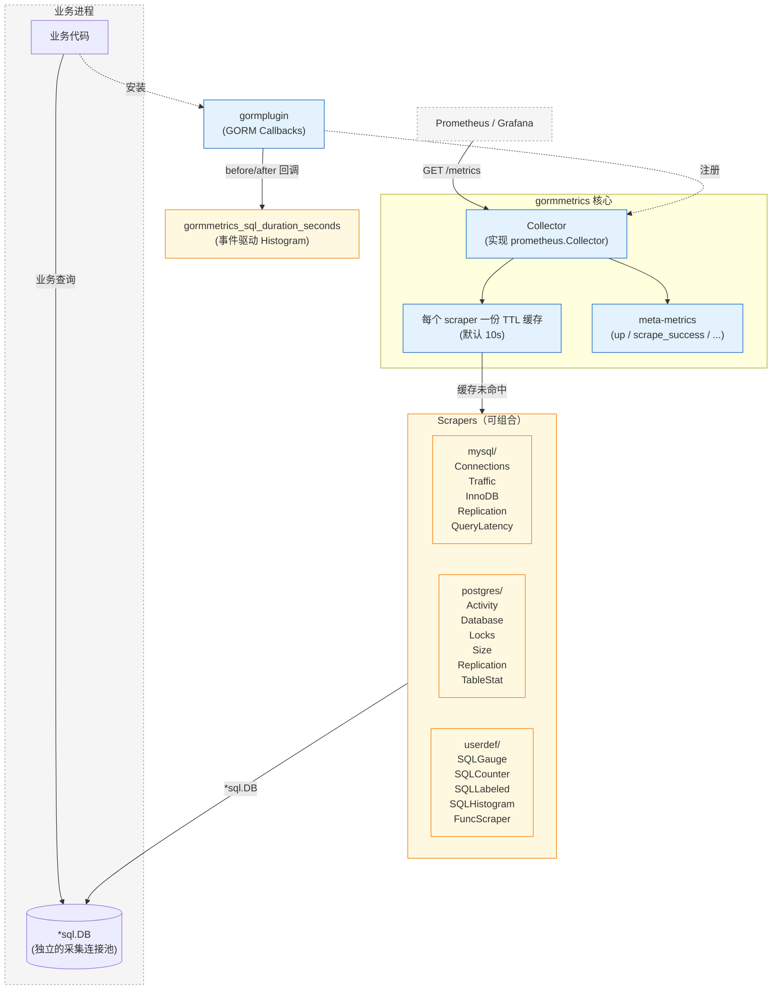
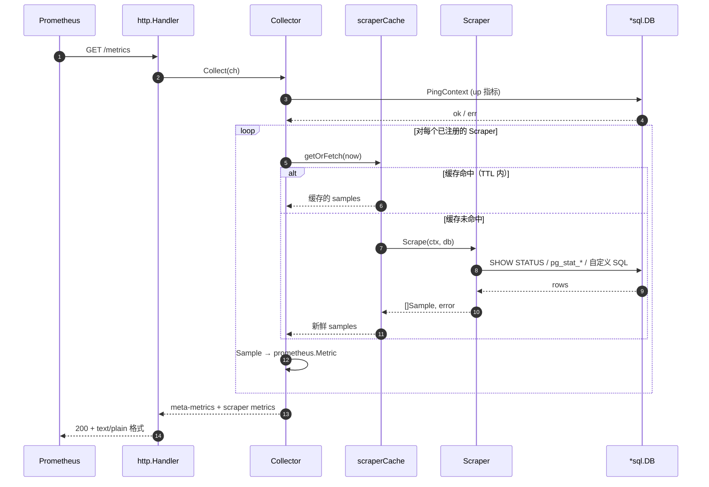
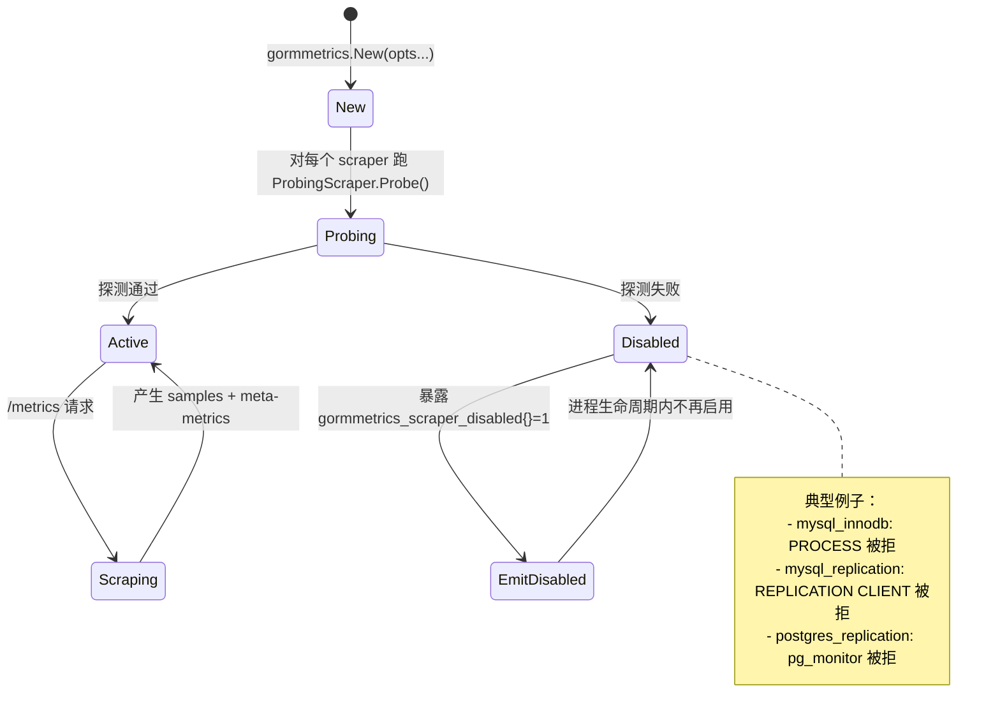
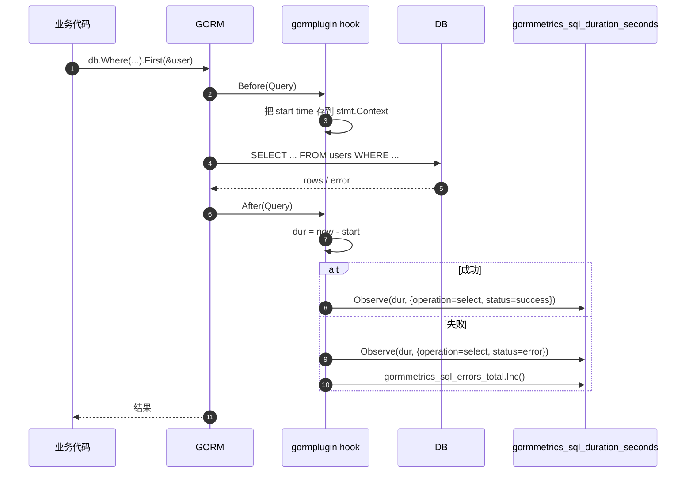

# gormmetrics

> 语言：[English](README.md) | **中文**

Go 应用内嵌的 SQL 数据库 Prometheus 指标导出库。同时暴露数据库内部指标（基于 `SHOW STATUS`、`pg_stat_*` 等）和 SQL 语句级埋点，并提供轻量的自定义业务指标 helper —— 全部由同一个 `/metrics` 端点提供。

```go
c, _ := gormmetrics.New(
    gormmetrics.WithDB(sqlDB),
    gormmetrics.WithScrapers(mysql.StandardPack()...),
    gormmetrics.WithLabels(map[string]string{"cluster": "prod"}),
)
http.Handle("/metrics", c.Handler())
```

## 功能特性

| 特性 | 描述 |
|------|------|
| **被动采集模型** | Prometheus pull `/metrics` 时才查 DB，不起后台 goroutine。10 秒短缓存防止多 Prometheus 实例打爆 DB |
| **无状态 Counter** | Counter 透传服务器汇报的绝对值（CounterValue），由 Prometheus 的 `rate()` 处理 reset。进程内不维护 delta，多副本一致 |
| **可组合 Scraper** | 每个后端的 scraper 都是小粒度、单职责单元。`mysql.StandardPack()` 这种预设只是 `[]Scraper`，可自由挑选/混搭 |
| **GORM 可选** | 核心 API 只认 `*sql.DB`，独立的 [gormplugin](https://github.com/phpgao/gormplugin) 仓库提供 GORM 集成（按需引入） |
| **原生 Histogram 支持** | `userdef.SQLHistogram` 处理预聚合的 SQL 直方图；`gormplugin.WithSQLLatency()` 按 operation/dialector/status 实时记录每条 SQL 延迟 |
| **权限退避** | 需要特殊授权的 scraper（`PROCESS`、`pg_read_all_stats` 等）通过 `ProbingScraper` 接口启动时探测一次，失败永久禁用并通过 `gormmetrics_scraper_disabled{}` 暴露，不刷 ERROR 日志 |
| **每个后端三档预设** | `MinimalPack` / `StandardPack` / `FullPack` 严格包含关系。先用小档跑起来，授权扩展时不用改业务代码自动获得更多指标 |
| **总是暴露的 meta-metrics** | `gormmetrics_up`、`gormmetrics_scrape_success`、`gormmetrics_scrape_duration_seconds`、`gormmetrics_scrape_errors`、`gormmetrics_scraper_disabled` —— 独立于 DB 本身告警采集健康度 |

## 架构



两条互补的数据通路：

- **Pull 通路**：Prometheus 抓 `/metrics` 时，Collector 遍历已注册的 Scrapers，每个 scraper 的结果缓存 10 秒，避免多 Prometheus 实例打爆 DB
- **Push 通路**（通过 gormplugin）：GORM 每条 SQL 触发 Before/After callback，把延迟塞进 Histogram。数据落到同一个 `/metrics` 端点

### `/metrics` 请求时的采集流程



### 探测与权限退避



## 快速开始

```bash
go get github.com/phpgao/gormmetrics
```

```go
package main

import (
    "database/sql"
    "log"
    "net/http"

    _ "github.com/go-sql-driver/mysql"

    "github.com/phpgao/gormmetrics"
    "github.com/phpgao/gormmetrics/mysql"
)

func main() {
    db, _ := sql.Open("mysql", "root:secret@tcp(localhost:3306)/mydb")
    db.SetMaxOpenConns(2) // 给采集用的独立小连接池

    c, err := gormmetrics.New(
        gormmetrics.WithDB(db),
        gormmetrics.WithScrapers(mysql.StandardPack()...),
        gormmetrics.WithLabels(map[string]string{"instance": "orders-1"}),
    )
    if err != nil {
        log.Fatal(err)
    }
    http.Handle("/metrics", c.Handler())
    log.Fatal(http.ListenAndServe(":8080", nil))
}
```

## 配置选项

| 选项 | 默认值 | 说明 |
|------|--------|------|
| `WithScrapeTimeout` | 10s | 单个 Scraper 的最大执行时长。超时后 DB 查询会被 cancel。 |
| `WithProbeTimeout` | 5s | 启动时探测权限的最大时长。 |
| `WithCacheTTL` | 10s | 采集结果缓存多久。设为 0 可禁用缓存。 |
| `WithErrorClassifier` | 字符串匹配 | 用自定义函数替换默认的错误分类逻辑。见 [自定义错误分类](#自定义错误分类)。 |

## 采集档位

每个后端（`mysql/`、`postgres/`）都提供三档预设，**严格包含关系**——Standard 包含 Minimal 的全部，FullPack 又包含 Standard 的全部。

| 档位 | MySQL | PostgreSQL |
|------|-------|------------|
| `MinimalPack()` | Connections | Activity, Size |
| `StandardPack()`（推荐默认） | + Traffic + InnoDB | + Database stats + Locks |
| `FullPack()` | + Replication + Query 延迟 Histogram | + Replication + Per-table stats |

需要单挑 scraper：

```go
gormmetrics.WithScrapers(
    mysql.ConnectionsScraper{},
    mysql.TrafficScraper{},
    // 跳过 InnoDBScraper 因为没 PROCESS 权限
    &mysql.ReplicationScraper{},
)
```

## 权限退避

需要额外授权的 scraper 实现 `ProbingScraper` 接口。Collector 构造时每个 probe 执行一次；失败的 scraper 在进程生命周期内永久禁用，通过 meta-metric 暴露：

```
gormmetrics_scraper_disabled{scraper="mysql_innodb",reason="permission_denied"} 1
gormmetrics_scraper_disabled{scraper="mysql_replication",reason="permission_denied"} 1
```

这意味着你可以放心地把 `StandardPack()` 给只有**部分**权限的连接账号——能跑通的 scraper 正常产指标，不能跑的静默躺在 disabled gauge 上。**不刷日志、不产生半坏的数据**。

## 自定义指标

`userdef/` 提供 4 个构件，每个声明只需 5-10 行（从零写 Scraper 接口要 100 行）。

```go
// 标量查询 → Gauge
&userdef.SQLGauge{
    MetricName: "orders_pending_count",
    Query:      "SELECT COUNT(*) FROM orders WHERE status='pending'",
}

// 标量查询 → Counter（数据源是单调递增）
&userdef.SQLCounter{
    MetricName: "orders_processed_total",
    Query:      "SELECT lifetime_count FROM order_stats WHERE id=1",
}

// 多行查询 → 每行一个 Sample，按列做 label
&userdef.SQLLabeled{
    MetricName:   "orders_by_status",
    Query:        "SELECT status, COUNT(*) FROM orders GROUP BY status",
    Type:         gormmetrics.Gauge,
    LabelColumns: []string{"status"},
    // ValueColumn 默认取最后一列
}

// SQL 预聚合 → Histogram
&userdef.SQLHistogram{
    MetricName:   "request_duration_seconds",
    BucketsQuery: "SELECT bucket_upper_sec, cum_count FROM req_hist ORDER BY 1",
    CountQuery:   "SELECT total_count FROM req_summary",
    SumQuery:     "SELECT total_seconds FROM req_summary",
}

// 任何其他场景（文件系统、外部 HTTP、计算值...）
&userdef.FuncScraper{
    ID:   "sqlite_db_file_size_bytes",
    Help: "SQLite DB 文件大小",
    Collect: func(_ context.Context, _ *sql.DB) ([]gormmetrics.Sample, error) {
        fi, err := os.Stat("/var/lib/myapp/foo.db")
        if err != nil { return nil, err }
        return []gormmetrics.Sample{{
            Name:  "sqlite_db_file_size_bytes",
            Type:  gormmetrics.Gauge,
            Value: float64(fi.Size()),
        }}, nil
    },
}
```

## GORM 集成

独立的 [gormplugin](https://github.com/phpgao/gormplugin) 仓库提供两个额外能力：

1. **`gorm.Plugin` 包装** —— 用习惯的 `db.Use(...)` 安装 Collector
2. **每条 SQL 的延迟 Histogram** —— 事件驱动，通过 `WithSQLLatency()` 开启。按 operation（select/insert/update/delete/row/raw）、dialector（mysql/postgres/sqlite/...）、status（success/error）三个维度记录每条 SQL 耗时



```go
g, _ := gorm.Open(mysql.Open(dsn), &gorm.Config{})
sqlDB, _ := g.DB()

c, _ := gormmetrics.New(
    gormmetrics.WithDB(sqlDB),
    gormmetrics.WithScrapers(mysqlscrape.StandardPack()...),
)

g.Use(metrics.New(c,
    metrics.WithSQLLatency(),
    metrics.WithLatencyConstLabels(map[string]string{"service": "orders-api"}),
))

http.Handle("/metrics", c.Handler())
```

产出的指标：

```
gormmetrics_sql_duration_seconds_bucket{operation="select",dialector="mysql",status="success",service="orders-api",le="0.01"} ...
gormmetrics_sql_duration_seconds_count{operation="select",dialector="mysql",status="success",service="orders-api"} ...
gormmetrics_sql_duration_seconds_sum{operation="select",dialector="mysql",status="success",service="orders-api"} ...
gormmetrics_sql_errors_total{operation="select",dialector="mysql",service="orders-api"} ...
```

常用 PromQL：

```promql
# 按 operation 的 p99 延迟
histogram_quantile(0.99,
  sum by (le, operation) (rate(gormmetrics_sql_duration_seconds_bucket[5m])))

# SQL 错误率
sum by (operation) (rate(gormmetrics_sql_errors_total[5m]))
```

## 常量 Label

`WithLabels(...)` 给**每个** sample 加 label，meta-metrics 也包含。
sample 自带 label 在冲突时优先（让 scraper 能覆盖默认值）。
适合放实例级别的维度：

```go
gormmetrics.WithLabels(map[string]string{
    "cluster":     "prod-eu-1",
    "shard":       "07",
    "environment": "production",
})
```

多实例场景（同进程主库+从库）给每个 Collector 不同 const labels 即可——Prometheus 层面 label 组合不同就是不同序列，不会冲突。

## Meta-metrics（总是暴露）

| 指标 | 类型 | 含义 |
|------|------|------|
| `gormmetrics_up` | Gauge | 上次 `db.Ping()` 成功为 1 |
| `gormmetrics_scrape_success{scraper}` | Gauge | 各 scraper 上次成功标志 |
| `gormmetrics_scrape_duration_seconds{scraper}` | Gauge | 各 scraper 上次耗时 |
| `gormmetrics_scrape_samples{scraper}` | Gauge | 上次产出的 sample 数 |
| `gormmetrics_scrape_errors{scraper, error}` | Gauge | 当前累计错误数，按类别区分（`permission_denied` / `connectivity` / `query` / `timeout` / `other`）。进程重启后归零。 |
| `gormmetrics_scraper_disabled{scraper, reason}` | Gauge | 被 probe 永久禁用的 scraper 标为 1 |

告警示例：

```yaml
- alert: GormMetricsScrapeFailing
  expr: gormmetrics_scrape_success == 0
  for: 5m
```

## 缓存与多实例采集

每个 scraper 有自己的 10s TTL 缓存（`WithCacheTTL` 调整）。两个 Prometheus 实例在 10 秒内抓同一个 `/metrics`，只有一个真的去查 DB，另一个吃缓存。测试场景设为 `0` 关闭缓存。

## 自定义错误分类

采集错误会带上类别标签（`permission_denied`、`connectivity`、`query`、`timeout`、`other`），方便按失败模式告警。默认使用字符串匹配，无需引入 driver 包。

如需用 driver 特有类型做精确分类（如 `*mysql.MySQLError.Number` 或 `*pgconn.PgError.Code`）：

```go
import (
    "github.com/go-sql-driver/mysql"
    "github.com/jackc/pgx/v5/pgconn"
)

c, err := gormmetrics.New(
    gormmetrics.WithDB(db),
    gormmetrics.WithScrapers(mysql.StandardPack()...),
    gormmetrics.WithErrorClassifier(func(err error) string {
        if mysqlErr, ok := err.(*mysql.MySQLError); ok {
            switch mysqlErr.Number {
            case 1045, 1142, 1143, 1227, 1405:
                return "permission_denied"
            case 2003, 2006, 2013:
                return "connectivity"
            case 1064:
                return "query"
            }
        }
        if pgErr, ok := err.(*pgconn.PgError); ok {
            switch pgErr.Code {
            case "42501", "42000":
                return "permission_denied"
            case "08001", "08006":
                return "connectivity"
            }
        }
        return "other" // 回退到字符串匹配
    }),
)
```

优先级：自定义分类器 → 默认字符串匹配。若自定义分类器返回空字符串，则回退到默认。

## 集成测试

```bash
GORMMETRICS_MYSQL_DSN='user:pass@tcp(host:3306)/db' \
GORMMETRICS_POSTGRES_DSN='host=h port=5432 user=u password=p dbname=d sslmode=disable' \
    go test -v ./tests/...
```

DSN 环境变量没设时对应的测试 Skip，所以只配一个也能跑。

## License

MIT，见 `LICENSE`。
